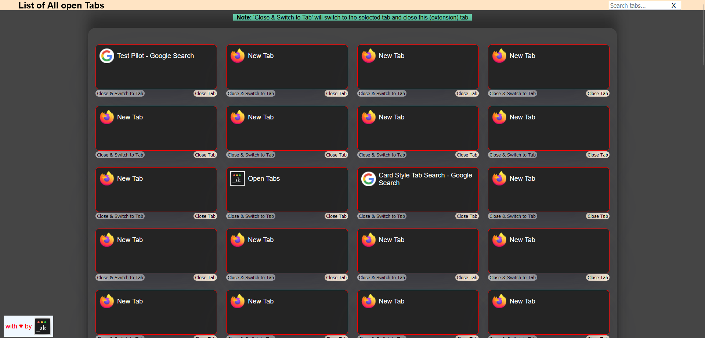

#### Extension URL:

- Firefox: [Card Style Tab Search](https://addons.mozilla.org/en-US/firefox/addon/card-style-tab-search/)
- Chrome: [Card Style Tab Search](https://chromewebstore.google.com/detail/card-style-tab-search/dhfjjdkjcbmjhfhhpiccjnjgndcheaia)

# Card Style Tab Search

## List and Manage All Open Tabs

This extension allows you to view, search, switch to, and manage all your open tabs in a convenient list. Easily find the tab you're looking for, switch to it, or close tabs directly from the extension. Also includes a feature to open the tab list in a new tab for a larger view.

## Description

### List All Tabs Extension

The "List All Tabs" extension provides a simple yet powerful way to manage all your open tabs in Firefox. With this extension, you can:

- View All Tabs: See a comprehensive list of all currently open tabs, sorted in descending order by the time they were opened.
- Search Tabs: Quickly find the tab you need by searching through tab titles and URLs.
- Switch Tabs: Click on any tab in the list to immediately switch to it, bringing it into focus.
- Close Tabs: Easily close tabs directly from the list to keep your browsing session organized.
- Open in New Tab: Open the tab list in a new browser tab for a larger view, making it easier to manage a large number of open tabs.
- Favicon Display: Each tab entry includes its favicon for easy identification.
  This extension is perfect for users who often have many tabs open and need a better way to navigate and manage them. Whether you're a power user, researcher, or just someone who likes to keep many tabs open, this extension will enhance your browsing experience.

### Features:

List all open tabs with their titles, URLs, and favicons.
Search through open tabs by title or URL.
Switch to any tab with a single click.
Close tabs directly from the list.
Open the tab list in a new tab for a larger view.

## How to Use:

1. Click the extension icon to open the tab list in a popup.
2. Use the search bar to filter tabs by title or URL.
3. Click on a tab's title to switch to it, or use the "Close Tab" button to close it.
4. Use the "Open in New Tab" button to view the tab list in a larger, dedicated tab.
5. Simplify your tab management and enhance your browsing experience with the "Card Style Tab Search" extension!

Permissions:
This extension requires access to your browser tabs to list and manage them. No other data is collected or transmitted.

Firefox:

Chrome:

