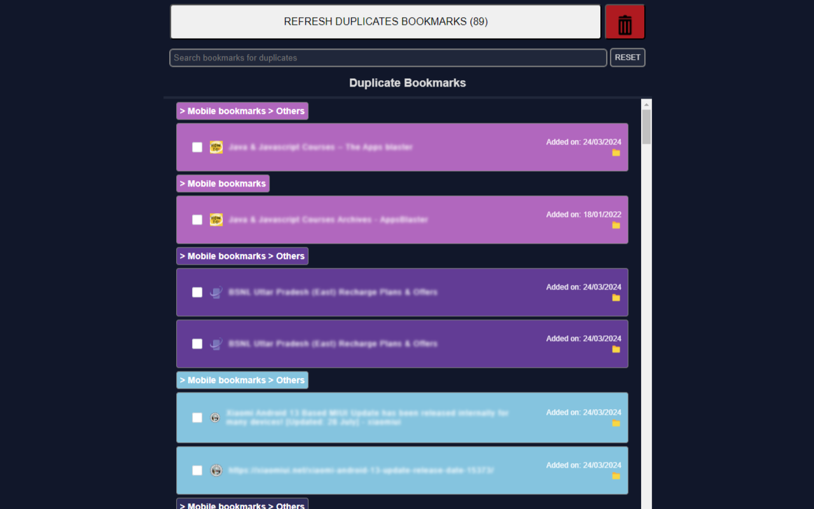

# Overview:

Quick Bookmarks Finder is an essential browser extension that is designed to help you efficiently search your bookmarks. It offers powerful tools to search, and eliminate duplicate bookmarks, ensuring your bookmark library remains clutter-free and easy to navigate.

## Features:

- Duplicate Bookmark Detection: Automatically scan your bookmarks to find and list the duplicates bookmarks. It allows to select duplicate bookmarks and remove to keep bookmarks library clean and organized.
- Comprehensive Search Functionality: Quickly find specific bookmarks using a powerful search tool that scans through your entire bookmark collection.
- Easy To Search Interface: User-friendly interface to easily search and inspect the bookmarks' folder structure.
- Recent Bookmarks: Easily find the recently saved bookmarks and find the folder in which it is saved.
- Quick Access: Access your bookmarks directly from the extension popup for faster navigation.
- Context Menu Integration: Right-click on extension icon to instantly open bookmark finder or duplicate bookmark finder in new tab.

## How to Use:

- Install the Extension: Click on "Add to Browser" to install the Bookmark Finder and Duplicate Manager.
- Open the Extension: Click on the extension icon in your browser toolbar to open the bookmark finder interface.
- Scan for Duplicates: Use the duplicate finder tool to scan your bookmarks and remove any duplicates.
- Search Bookmarks: Use the search bar to quickly find specific bookmarks by name or URL.

## Permissions:

This extension requires access to your bookmarks to provide its features. We prioritize your privacy and do not collect or share any personal data.

Firefox:

Chrome:

